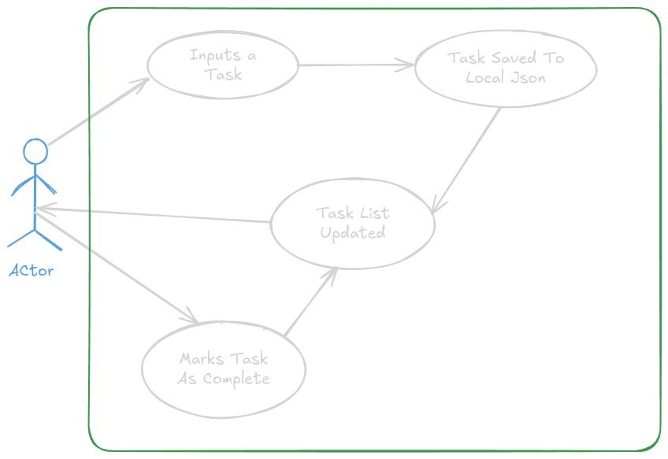
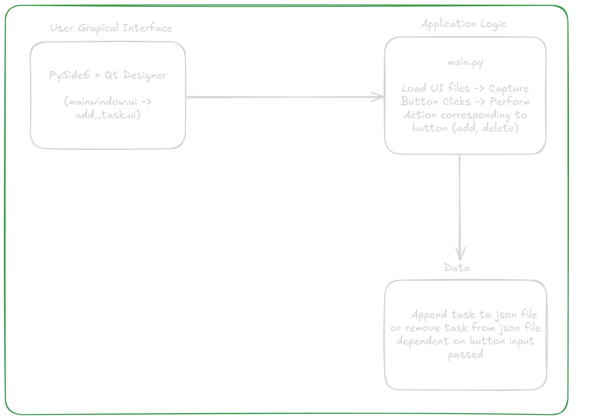

# Overview
This application is a simple and easy to use to do list. It will store data written to it on a JSON file stored locally on the device. Data is stored locally only so it is the user's responsibility to back up the data.

The primary goal of this application is to store tasks, as a reminder, as an organizer, or whatever else you choose to use its features. The ui files are included in this repository as it is essential for the application, that being said if the look and feel does not suit your needs it is easily modifiable, or users may also choose to use qt designer (installed with pyside6) to generate new ui files. Another concern of ours was privacy. Applications and many Saas solutions provides a lot of convenience through redundancy and availability. However, for the more privacy concious users, this application will not store your data anywhere besides the local **toDoList.json** file. This way privacy level is decided by the end user. You may store this file in one drive, iCloud, or any other cloud storage solution if you wish. Please note that by doing so modifications may have to be made to the **toDoList.py** file so that the current path is established for the filename variable.

The application will be written in python on the Qt SDK (pyside6). The application must be cross platform compatiable for Windows, MacOS, and Linux hence Qt.

A compiled executable may be made by using PyInstaller to compile the source code. There is already a compiled version of this in dist/main but it is only compatiable with linux. If you wish to use a compiled version please install pyinstaller. Users may also choose to clone the repository, install all dependencies and run it just as a .py. Dependencies are located in requirements.txt.

## Use Case Diagrams 

| Feature | Focus | Symbol |
|---------|-------|--------|
| Actor   | This application is meant for general purpose usage, anyone may use it | Stick Figure |
| Use Case| Organize tasks into one application without having to pay for a subscription and all your data stays local | Oval |
| System Boundary | To maintain privacy all data is local to the end user. The only external entity that interacts with the application is therefore the end user | Rectangle | 

## Adding Task 

| Feature | Focus | Symbol |
|---------|-------|--------|
| Actor   | User | Stick Figure |
| Use Case| User wants to add task to list | Oval |


### Diagram

<p align="center">
    
</p>

Every action taken is by the end user. There are no further external entities. An end user should be able to add a task, complete a task, and view all of their tasks. 

## System Architecture

<p align="center">
    
</p>

There are purposely minimal system components, as you can see from the diagram above. The application is meant to be simple and light weight as to not introduce much complexity to adding a task to your todo list. It is also minimal by design so that end users may customize the look and feel to suit their requirements. And to reiterate, the data is stored locally in plaintext in *toDoList.json*, it is therefore the responsiblity of the end user to maintain the integrity and redundancy of their data within the application. If cloud components, such as cloud storage was added, there would be no way with certainty that an end user can guarantee the privacy of their data. As who's to say that no one is looking at your data when it is stored external to your device by a 3rd party to include the developers of this application.

The user interface is supported by the Qt SDK for python. The .ui files were exported from the Qt designer.

## Design

### toDoList.py

**save_tasks** : It's sole purpose is to write data to the json file.

**load_tasks** : This function passes the json structure to *main.py* to display the list of tasks. If the *toDoList.json* is empty:

```json
{
    "tasks" : []
}
```
It will return an empty array and MainWindow will display "No tasks yet".

**add_task** : This function adds a task to the json file. It's structure is as follows:

```json
{
    "title": title,
    "task": task,
    "due_date": due_date,
    "created_date": now
}
```

**deleteTask** : Removes a task from the json file once marked complete by the complete button on the MainWindow. It first calls **load_tasks** and sets the found variable to false. It proceeds to iterate through the json structure to find the corresponding title value. Once the task is found, found inherits the value of true and returns found. If found remains false the application will state that the task was not found. Though this should never happen as the application should refresh after each action.

### main.py

#### AddTaskDiaglog

**__init__(self)** : This defines the constructor for the add task "pop up". It is a dialog box in Qt terms. It starts by calling the parent from the Qt SDK **QDialog.__init__()** ensuring that everything is initialized properly. We use QFile here because it is Qt's way of file handling, and we open the ui file in read only mode because no write operations will occur to the ui file as it would render it instable. We proceed to load the gui_file (add_task.ui) and this is embeded within the QDialog making it a child of QDialog. The button accepts two "signals" so to speak. It can either reject the changes where no write action would occur or it can accept the changes where the changes would be written to the json file and rendered in the MainWindow.

**get_task_data** : "titleInput", "descInput", and "dueInput" finds the Qt input widgets by their object names. Please note that if modifications are made to the ui file, the object name must remain the same if no changes are to be made to the python code. Then it proceeds to extract the contents from the input fields to be displayed in the MainWindow, stripping all leading and trailing whitespace.

#### MainWindow

**__init__(self)** : This function initializes the main window. Loading "mainWindow.ui". Note we did not use "super()" here, it was not working most likely due to a flaw in the logic, but this has been mitigated with the **show** function. Again we open the ui file in read only mode. Because we didn't use super() here we couldn't do this like in **AddTaskDialog**:

```python
self.window.setParent(self)
```

Instead we had to set self.window to refer to the gui window:

```python
self.window = loader.load(ui_file)
```

Next we proceed to insert all of the task widgets in a vertical layout. Meaning the tasks will be displayed in a vertical fashion (top to bottom). Note the "scrollAreaWidgetContents" will not appear until there are enough tasks to fill the vertical layout window. The button widget in this main window is to add a task. Once it is clicked it will populate the AddTaskDialog window, and once that action is completely the MainWindow will refresh immediately.

**refresh_tasks** : This starts by getting a count of tasks currently in the layout. We refresh by removing all the widgets in the MainWindow vertical layout until there are no widgets left, then we load the tasks again from the json file. If there are no task the vertical layout will simply state "No tasks yet". The for loop here just iterates through the json structure looking for existing task and repopulates its widget in the vertical layout.

**open_add_tasks** : As you can guess is used to open the add task window. Notice in **__init__**:

```python
self.add_button.clicked.connect(self.open_add_task)
```

Here we check to ensure the user entered at least a value for the title, else we will use Qt to throw an error stating that a "Title is Required". If the task was successfully added then we proceed to refresh the MainWindow with the addition of the newly added task.

**complete_task** : Calls the *deleteTask* function passing the title of the completed task. This task will be removed from the json structure and the MainWindow will refresh with the subtraction of the completed task.

The main function starts with the common:

```python
if __name__ == "__main__"
```

Instructing python to only execute this file if it is being called directly. This lets python know this is the main file. The app variable creates the Qt application object so to speak.

```python
app = QApplication([])
app.exec()
```

The ui variable just renders the MainWindow upon start up of the applciation. Without it the app would run but nothing would be rendered.

```python
ui = MainWindow()
ui.show()
```
